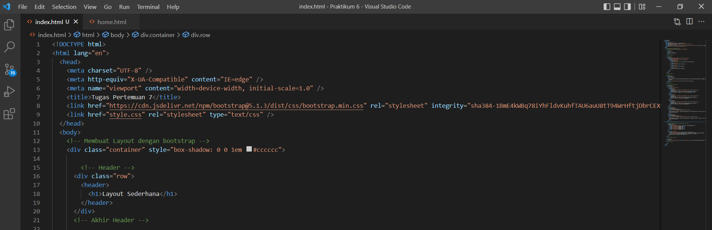
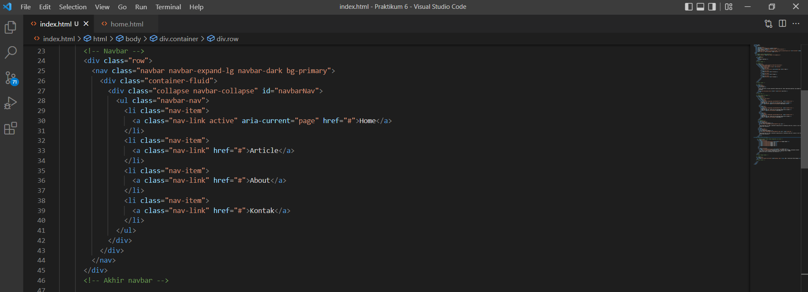
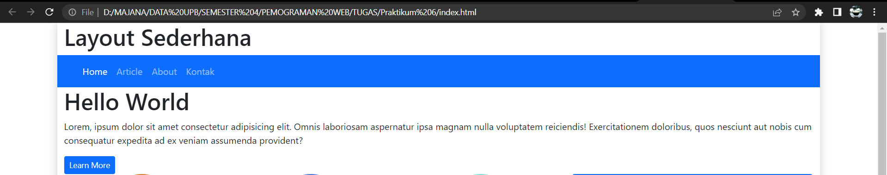
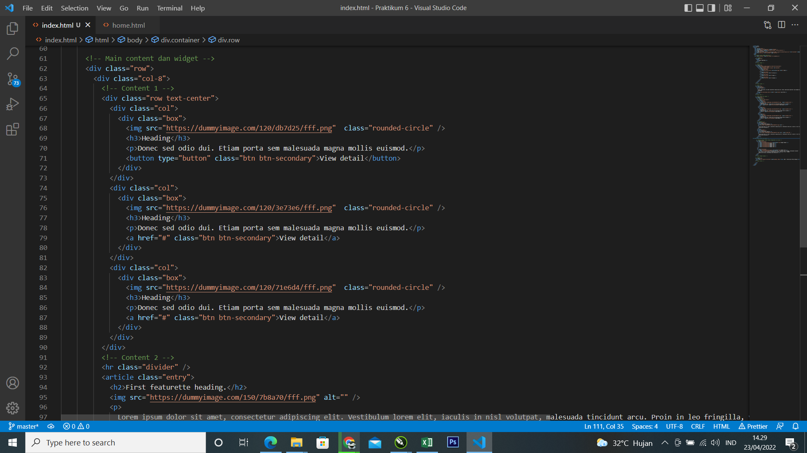
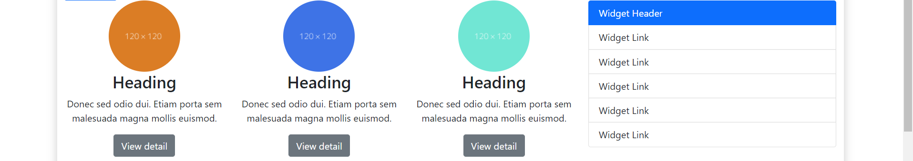
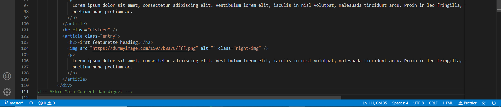
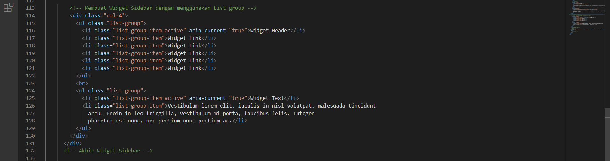
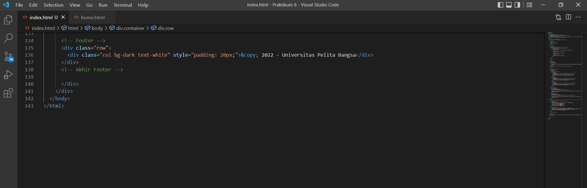
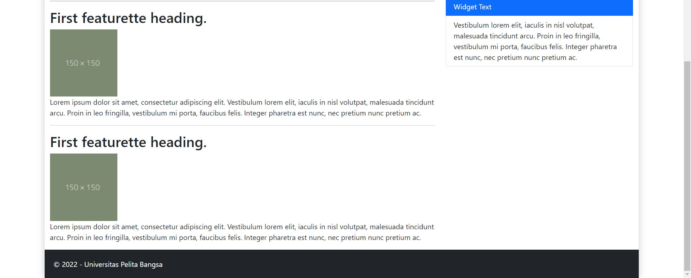

# lab6_css_framework
# Ahmad Alfian Chandra
# 312010336
# TI.20.A2

# Praktikum 6

- Berikut Source code pembuatan header file index.html
  

- Berikut Source code pembuatan header Nav bar
  

- Tampilan dan hasil pada browser
  

- Berikut Source code kolom sisi kiri untuk Heading dan kolom sisi kanan untuk widget Header.
  Berikut source code yang saya buat.
  

- Tampilan dan Hasil pada Browser
  

- Menambahkan Source codearticle content
  
  
  

- Tampilan dan Hasil pada Browser
  
